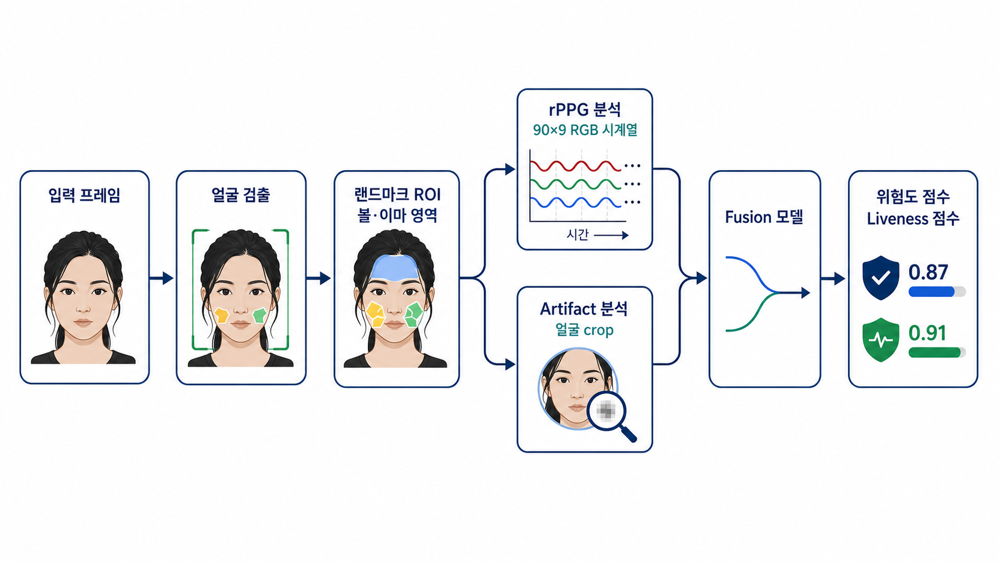

# Deepfake Risk Estimation Model Framework

이 저장소는 얼굴 기반 deepfake 위험도 추정을 위한 **멀티브랜치 모델 프레임워크**를 다룹니다.

핵심 목표는 얼굴 이미지의 시각적 조작 흔적과 얼굴 피부 영역의 RGB temporal signal을 함께 사용해 deepfake risk score와 liveness score를 추정하는 것입니다.

## 모델 프레임워크 개요



```text
얼굴 crop 이미지
  -> ReXNet-100 artifact branch

볼/이마 ROI RGB 시계열
  -> rPPG TCN branch

artifact feature + rPPG feature + quality feature
  -> fusion classifier
  -> fake probability / liveness score
```

이 구조는 rPPG만으로 fake 여부를 판단하지 않습니다. rPPG branch는 liveness와 temporal consistency를 보조하고, artifact branch는 얼굴 texture와 합성 흔적을 분석합니다. 최종 판단은 fusion classifier가 두 branch의 feature를 결합해 수행합니다.

## 입력 형식

모델은 원본 영상을 직접 입력으로 받지 않습니다. 모델 기준 입력은 다음 세 가지 tensor입니다.

```text
rppg_window: B x 90 x 9
face_crop:   B x 3 x 96 x 96
quality:     B x 3
```

### rPPG 입력

`rppg_window`는 볼과 이마 ROI의 RGB 평균값으로 구성된 temporal signal입니다.

한 frame의 rPPG raw signal:

```text
R_left, G_left, B_left,
R_right, G_right, B_right,
R_forehead, G_forehead, B_forehead
```

기본 window는 90 frames이며, 30 FPS 기준 약 3초 길이입니다.

### Artifact 입력

`face_crop`은 얼굴 bbox 기준 crop을 `96 x 96`으로 resize한 RGB tensor입니다.

```text
face_crop: 3 x 96 x 96
value range: 0..1
```

### Quality 입력

`quality`는 fusion classifier가 입력 신뢰도를 참고할 수 있도록 제공하는 보조 feature입니다.

```text
quality[0] = ROI quality
quality[1] = face / landmark detection quality
quality[2] = motion or signal quality
```

## Landmark ROI 구성

rPPG branch는 얼굴 전체가 아니라 피부 노출 영역의 RGB 변화를 사용합니다.

사용 ROI:

- left cheek
- right cheek
- forehead

현재 환경에서는 MediaPipe Tasks API의 `FaceLandmarker`를 사용해 얼굴 landmark를 추출했습니다.

```text
mediapipe version = 0.10.35
mp.solutions = 없음
mp.tasks = 있음
```

FaceLandmarker가 반환한 landmark 좌표를 pixel 좌표로 변환한 뒤, 볼과 이마에 해당하는 landmark index들을 polygon으로 묶어 ROI를 구성합니다.

## Branch 구조

### 1. rPPG TCN Branch

입력:

```text
B x 90 x 9
```

역할:

- ROI RGB temporal pattern 분석
- estimated HR 추정
- rPPG liveness feature 생성

이 branch는 이미지 feature vector가 아니라 원본 RGB temporal signal을 사용합니다.

### 2. ReXNet-100 Artifact Branch

입력:

```text
B x 3 x 96 x 96
```

역할:

- 얼굴 texture artifact 분석
- blending / boundary artifact 분석
- 압축과 합성 흔적에 민감한 visual feature 생성

현재 artifact backbone은 ReXNet-100으로 고정되어 있습니다.

### 3. Fusion Classifier

입력:

```text
rPPG feature
artifact feature
quality feature
```

출력:

```text
fake_probability
liveness_score
confidence_score
```

최종 risk score는 `fake_probability`를 중심으로 해석합니다. `confidence_score`는 입력 품질과 예측 안정성을 보조적으로 해석하기 위한 값입니다.

## 학습 구조

학습은 세 단계로 구성됩니다.

### Stage 1. rPPG Branch 학습

데이터셋:

```text
UBFC-rPPG
```

목표:

```text
ROI RGB temporal signal -> HR / pulse-related representation
```

명령 예시:

```powershell
python train_rppg.py --data-root datasets/UBFC-rPPG --windows-dir datasets/UBFC-rPPG/windows --epochs 50 --batch-size 32 --val-ratio 0.2 --lr 1e-3
```

### Stage 2. Artifact Branch 학습

데이터셋:

```text
FaceForensics++ face_frames
```

목표:

```text
face crop -> real / fake probability
```

명령 예시:

```powershell
python train_artifact.py --data-root datasets/FaceForensics++ --frames-dir datasets/FaceForensics++/face_frames --epochs 15 --batch-size 32 --grad-accum-steps 2 --num-workers 2 --val-ratio 0.1 --lr 7e-4 --backbone-lr 7e-6 --augment
```

### Stage 3. Fusion Classifier 학습

데이터셋:

```text
FaceForensics++ face_frames
FaceForensics++ rppg_v2
```

목표:

```text
rPPG feature + artifact feature + quality feature -> final fake probability
```

명령 예시:

```powershell
python train_fusion.py --data-root datasets/FaceForensics++ --frames-dir datasets/FaceForensics++/face_frames --rppg-dir datasets/FaceForensics++/rppg_v2 --rppg-weights checkpoints/rppg_tcn.pt --artifact-weights checkpoints/artifact_rexnet_100.pt --epochs 20 --batch-size 32 --grad-accum-steps 2 --num-workers 2 --val-ratio 0.1 --lr 7e-4 --augment
```

## 데이터셋 구조

데이터셋은 저장소에 포함하지 않습니다.

예상 구조:

```text
datasets/
  UBFC-rPPG/
    subject_01/
      vid.avi
      ground_truth.txt

  FaceForensics++/
    original/
      *.mp4
    Deepfakes/
      *.mp4
    face_frames/
      real/*.jpg
      fake/*.jpg
    rppg_v2/
      real/*_rppg.npy
      fake/*_rppg.npy
```

## 평가 참고값

현재 준비된 FaceForensics++ split 기준 내부 검증 예시:

```text
sample_level acc=0.8550 auc=0.9414
video_level  acc=0.9070 auc=0.9773
```

이 값은 데이터 split, preprocessing, checkpoint에 따라 달라질 수 있습니다.

## ONNX 변환 범위

ONNX export는 모델 inference graph를 배포하기 위한 것입니다.

ONNX에 포함되는 부분:

```text
rPPG TCN branch
ReXNet-100 artifact branch
fusion classifier
```

ONNX 입력:

```text
rppg_window: B x 90 x 9
face_crop:   B x 3 x 96 x 96
quality:     B x 3
```

ONNX 변환 명령 예시:

```powershell
python export_onnx_raw.py --out checkpoints/pipeline_raw.onnx --rppg-weights checkpoints/rppg_tcn.pt --artifact-weights checkpoints/artifact_rexnet_100.pt --fusion-weights checkpoints/fusion_model.pt --opset 17 --verify
```

자세한 입력/출력 계약은 [ONNX_DEPLOYMENT.md](ONNX_DEPLOYMENT.md)를 참고하세요.

## 주요 코드

```text
models/rppg_tcn.py          rPPG temporal branch
models/artifact_rexnet.py   ReXNet-100 artifact branch
models/fusion_model.py      Fusion classifier
models/artifact_factory.py  Artifact model factory
data/                       Dataset loaders
utils/landmark_roi.py       Landmark ROI extraction utility
train_rppg.py               rPPG branch training
train_artifact.py           Artifact branch training
train_fusion.py             Fusion classifier training
eval_final.py               Final evaluation
export_onnx_raw.py          Raw-score ONNX export
export_onnx.py              Full-output ONNX export
```

## 문서

- [심사용 요약 가이드](docs/judge_guide.md)
- [데이터셋, 모델 설계, 학습 방법 설명서](docs/dataset_model_training_overview.md)
- [ONNX 배포 계약](ONNX_DEPLOYMENT.md)
- [최종 평가 및 시각화 명령어](FINAL_TEST.md)

## 한계

- rPPG는 보조 liveness signal이며, 단독 deepfake detector가 아닙니다.
- 모델 성능은 face crop 품질, ROI 추출 품질, 데이터셋 분포에 영향을 받습니다.
- unseen deepfake generation 방식이나 강한 motion/blur 조건에서는 일반화 성능이 낮아질 수 있습니다.
- 본 저장소는 해커톤 프로토타입 모델 프레임워크이며, 실제 보안 제품 수준의 검증 시스템은 아닙니다.

## 대용량 파일 정책

다음 파일과 폴더는 GitHub에 포함하지 않습니다.

```text
datasets/
checkpoints/
outputs/
*.pt
*.pth
*.onnx
utils/models/*.tflite
utils/models/*.task
```

